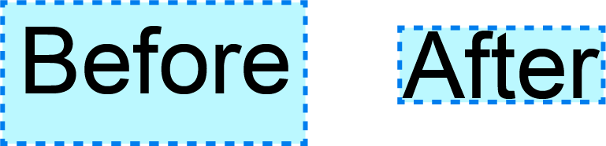

#  tailwindcss-text-box-trim

**Perfect typography spacing for Tailwind CSS v4+**

[](https://www.npmjs.com/package/tailwindcss-text-box-trim)
[](https://github.com/michaelcummings12/tailwindcss-text-box-trim/blob/main/LICENSE)
[](https://github.com/michaelcummings12/tailwindcss-text-box-trim)



<sub>**Before:** Standard text with excess space. **After:** Text with _text-box-trim_ applied, removing the excess space for perfect alignment.</sub>

Create pixel-perfect typographical layouts with precise control over the vertical spacing of text 🤩

Eliminate annoying leading whitespace and cap-height alignment issues with standard CSS. This package provides **Tailwind CSS utilities** for the [CSS Text Box Trim](https://developer.mozilla.org/en-US/docs/Web/CSS/text-box-trim) specification.

## Why use this?

Standard web typography often includes "internal leading" (extra space above and below the text glyphs) which makes it difficult to align text containers precisely with images, buttons, or other elements.

`text-box-trim` solves this by cropping that extra space, making your text behave more like a standard box model element.

Use `text-box-trim` along with `text-box-edge` to control which sides of the text box are trimmed and how much space to trim.

## Installation

Install the package via npm:

```bash
npm install tailwindcss-text-box-trim
```

## Usage

This package is designed for **Tailwind CSS v4+**.

Import the CSS in your main CSS file (e.g., `global.css`):

```css
@import "tailwindcss";
@import "tailwindcss-text-box-trim";
```

## Browser Support

`text-box-trim` is baseline available in **Chrome 133+** and **Safari 18.2+**.

Firefox support is [pending](https://bugzilla.mozilla.org/show_bug.cgi?id=1816038).

[](https://caniuse.com/css-text-box-trim)

### Utilities

#### _box-trim-\*_

Control which sides of the text box are trimmed.

- `box-trim-both`: Trims space from **both** start (top) and end (bottom).
- `box-trim-start`: Trims space from the **start** (top) only.
- `box-trim-end`: Trims space from the **end** (bottom) only.
- `box-trim-none`: Removes trimming.

#### _box-edge-\*_

Define the reference edge for trimming.

- `box-edge-text`: Trims to the text edge (default).
- `box-edge-cap`: Trims to the **cap height** (top of capital letters). Perfect for aligning headers.
- `box-edge-ex`: Trims to the x-height.
- `box-edge-alphabetic`: Trims to the alphabetic baseline.
- `box-edge-ideographic`: Trims to the ideographic baseline (CJK).

### Usage with tailwind-merge

Since these utilities do not collide with standard Tailwind classes (like `text-*` colors or sizes), **configuration is optional**.

However, if you want to support deduplication (e.g., ensuring `box-trim-both` overrides `box-trim-none` properly when both are present), you can configure it as follows:

```typescript
import { extendTailwindMerge } from "tailwind-merge";

export const twMerge = extendTailwindMerge({
  extend: {
    classGroups: {
      "box-trim": [{ "box-trim": ["both", "start", "end", "none"] }],
      "box-edge": [
        { "box-edge": ["text", "cap", "ex", "alphabetic", "ideographic"] },
      ],
    },
  },
});
```

## Keywords

Tailwind CSS, text-box-trim, leading-trim, cap-height trimming, typography, vertical pacing, web design, CSS spacing, frontend development
